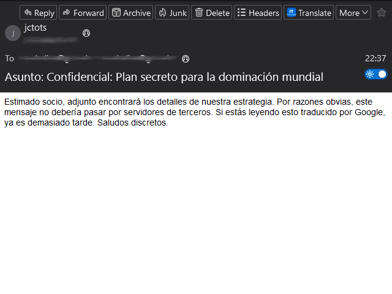
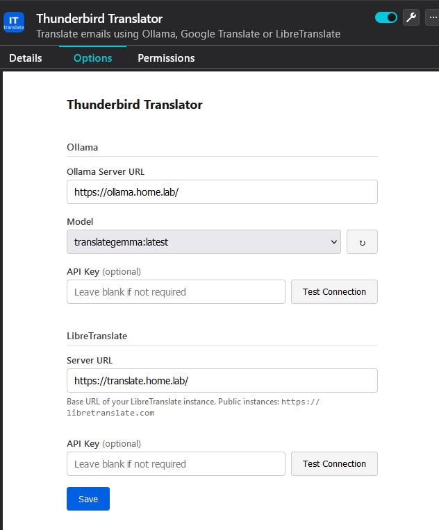
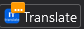
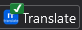
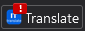

# Thunderbird Translator
**Privacy-first email translation — Ollama (local/self-hosted), LibreTranslate (self-hosted or public), or Google Translate as a fallback**

> **Fork of [zoott28354/thunderbird-translator](https://github.com/zoott28354/thunderbird-translator)**
> Extended with compose translation, auto-translate, local LibreTranslate support, and a native toolbar UI.

---

<p align="center">
  
</p>

---

## ✨ Features

- 🔒 **Privacy-first** — translate on your own machine or private network; your emails stay under your control
- 🏠 **Ollama** — local or self-hosted; zero external connections, works fully offline
- 🖥️ **LibreTranslate** — self-hosted on your own server, or use a public instance
- 🌐 **Google Translate** — available as a fallback when privacy is not a concern
- 🤖 **Supports all Ollama models** — translategemma, Llama, Mistral, and more
- 📨 **Translate received emails** — inline replacement with one-click restore
- ✍️ **Translate while composing** — select text in the compose window and translate it in place
- ⚡ **Auto-translate** — optionally translate every email automatically when opened
- 🌍 **10 target languages** — English, Italian, Spanish, French, German, Portuguese, Russian, Japanese, Chinese, Korean
- 💾 **Persistent settings** — service and language remembered per-service
- 🌐 **Multilingual interface** — 7 UI languages: 🇬🇧 English, 🇮🇹 Italian, 🇩🇪 German, 🇫🇷 French, 🇪🇸 Spanish, 🇵🇹 Portuguese, 🇷🇺 Russian

---

## 📋 Requirements

- **Thunderbird** 128 or later (ESR and non-ESR)
- **Ollama** — must be installed and running (local machine or private server); see [setup](#ollama-1)
- **LibreTranslate** — must be reachable (local machine, private server, or public instance); see [setup](#libretranslate-1)

---

## 📦 Installation

### From XPI file
1. Download `thunderbird-translator.xpi` from [Releases](../../releases)
2. In Thunderbird: **Menu → Tools → Add-ons**
3. Click the gear icon ⚙️ → **Install Add-on from file…**
4. Select the `.xpi` file and confirm

### Development / temporary load
1. In Thunderbird: **Ctrl+Shift+A → gear icon → Debug Add-ons**
2. Click **Load Temporary Add-on…**
3. Select `manifest.json` from the project folder

---

## ⚙️ Configuration

Open **Menu → Tools → Add-ons → Thunderbird Translator → Preferences**.

<p align="center">
  
</p>

### Ollama

| Field | Default | Notes |
|---|---|---|
| Server URL | `http://localhost:11434` | Change if Ollama runs on another machine |
| Model | — | Select from installed models; click ↻ to refresh |
| API Key | *(blank)* | Required only if Ollama is behind an auth proxy |

**Test Connection** — verifies reachability and lists available models.

#### Setup

**Local machine** — install from [ollama.ai](https://ollama.ai), then pull a model:
```
ollama pull translategemma
```

**Private server** — see the [Ollama Docker documentation](https://hub.docker.com/r/ollama/ollama).

### LibreTranslate

| Field | Default | Notes |
|---|---|---|
| Server URL | `https://libretranslate.com` | Replace with your own instance URL |
| API Key | *(blank)* | Required by some instances; leave blank for open ones |

**Test Connection** — calls `/languages` on the configured URL to verify reachability.

#### Setup

**Self-hosted** — see [LibreTranslate on GitHub](https://github.com/LibreTranslate/LibreTranslate) for installation options (local or server).

**Public instances** — use `https://libretranslate.com` or any other public instance. Some require an API key.

---

## 🎯 How to Use

### Reading emails

A **Translate** button appears in the message toolbar (next to Reply, Forward, etc.).

1. Open an email
2. Click **Translate** in the toolbar
3. Select service and target language in the popup
4. Click **Translate** — the email body is replaced inline
5. Click **Show Original** to restore

#### Auto-translate
Enable the **Auto-translate** checkbox in the popup to translate every email automatically when opened. A badge on the toolbar button shows progress:

<p align="center">
  &nbsp;&nbsp;
  &nbsp;&nbsp;
  
</p>

### Composing emails

A **Translate** button appears in the compose toolbar.

1. Write or paste text in the compose body
2. **Select** the text you want to translate
3. Click **Translate** in the toolbar
4. Choose service and target language in the popup
5. Click **Translate Selection** — selected text is replaced in place (undo works)

---

## 🔒 Security

| Mode | Data sent externally |
|---|---|
| Ollama (local) | Nothing — 100% on your machine |
| Ollama (self-hosted) | Nothing — stays on your private network |
| LibreTranslate (self-hosted) | Nothing — stays on your private network |
| LibreTranslate (public) | Email text only, to the configured instance |
| Google Translate | Email text only, to Google servers |

No tracking, no analytics. API keys and settings are stored locally in Thunderbird's own storage — never transmitted.

### Permissions
- `messagesRead` — reads email content for translation
- `messagesModify` — replaces displayed text with translation
- `compose` — injects translation script into compose windows
- `storage` — saves your settings locally
- `tabs` — identifies the active window for popup communication
- `*://*/*` — required because Ollama and LibreTranslate URLs are user-configurable; the extension only contacts the URLs you set in preferences

---

## 🚨 Troubleshooting

### "Error: Ollama error: 403 Forbidden"
Some Ollama versions or configurations block requests from browser extensions. Set `OLLAMA_ORIGINS=moz-extension://*` before starting Ollama and restart it.

### "Ollama model not found"
Run `ollama pull translategemma` (or whichever model is selected in settings).

### LibreTranslate: connection fails
- Verify the URL in settings matches your instance (e.g. `http://192.168.1.10:5000`)
- If your instance requires an API key, enter it in the API Key field
- Click **Test Connection** to confirm reachability before translating

### Compose: "No text selected"
Highlight text in the compose body *before* clicking the Translate button in the popup.

---

## 📜 Changelog

### v1.7.1 (fork — jctots)
- **Translated subject bar** — sticky bar at the top of the email body showing the translated subject; respects dark mode; removed on revert

### v1.7.0 (fork — jctots)
- **Compose translation** — select text in compose window and translate in place
- **Native toolbar UI** — action buttons in read and compose toolbars replace injected toolbar
- **Auto-translate** — optional per-email auto-translation with badge progress indicator
- **Self-hosted LibreTranslate** — configurable URL + optional API key; test connection button
- **Ollama API key** support for proxied/remote instances

### v1.6.0 (fork — jctots)
- **Injected toolbar** in message view — service selector, language selector, Translate/Restore buttons
- **Dark mode** support
- Source language detection and translation cache
- Dynamic Ollama URL; service dropdown in toolbar
- Simplified options page; fork authorship

### v1.5.0 (zoott28354)
- Deterministic tab/preview routing
- `messageDisplayScripts` programmatic registration (Thunderbird 128–147+)

### v1.0.0 (zoott28354)
- Initial release: Ollama, Google Translate, LibreTranslate; context menu UI; 7 UI locales

---

## 📝 License

MIT — free to use, modify, and distribute.
Original work by [zoott28354](https://github.com/zoott28354/thunderbird-translator).
